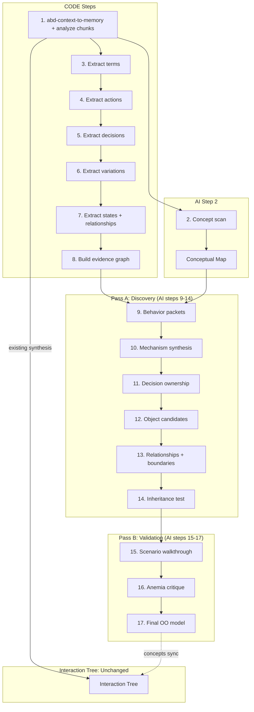

# Adapt abd-domain-synthesizer for OOAD Evidence Pipeline

## Core Change

The current skill does direct AI synthesis from raw context. The new approach uses a **13-phase pipeline**: script-driven evidence extraction followed by 8 focused AI modeling passes. The core principle: **Do not go from text to classes. Go from context -> mechanisms -> behavior owners -> object model.**

### The 17-Step Pipeline

```text
CODE
 1. Normalize + segment context               abd-context-to-memory skill + 01_analyze_chunks
 3. Extract terms                              02_extract_terms
 4. Extract actions (subject-verb-object)      03_extract_actions
 5. Extract decisions (rules/conditions)       04_extract_decisions
 6. Extract variations (mode/type diffs)       05_extract_variations
 7. Extract states & explicit relationships    06_extract_states
 8. Build evidence graph                       07_consolidate_evidence

AI
 2. Concept scan (primitives & mechanisms)     concept_scan operation
 9. Behavior packet detection                  --|
10. Mechanism synthesis                          |
11. Decision ownership                           |  model_discovery operation (Pass A)
12. Object candidate formation                   |
13. Relationship & boundary modeling             |
14. Inheritance test                           --|
15. Scenario / message walkthrough             --|
16. Anemia / centralization critique             |  model_validation operation (Pass B)
17. Final OO domain model                      --|
```

Step 1 uses the existing `abd-context-to-memory` skill for chunking. `01_analyze_chunks.py` validates and indexes the chunks afterward.

### Three rules that must never be violated

1. Do not go from nouns to classes
2. Do not assign behavior to services until you fail to find a real owner
3. Do not introduce inheritance until the domain proves substitutability and shared semantics




---

## What STAYS (no changes)

- **All interaction tree pieces**: `pieces/interaction.md` (443 lines) -- untouched
- **All interaction rules** (18 files): `interaction-*.md` -- untouched
- **Session/run/correction infrastructure**: `pieces/session.md`, `pieces/runs.md`, `pieces/correct.md`, `pieces/validation.md` -- untouched
- **DrawIO diagram tooling**: `pieces/diagrams.md`, `scripts/drawio_class_cli.py`, `scripts/drawio_tools.py` -- untouched
- **All existing scanners** (26 files) -- untouched
- **Core build scripts**: `scripts/build.py`, `scripts/instructions.py`, `scripts/engine.py`, `scripts/abd_skill.py`, `scripts/config.py`, `scripts/rule_set.py` -- minor updates only
- **Context rules**: `context-derive-from-source.md`, `context-speculation-assumptions.md`, `context-deep-mechanical-analysis.md`, `context-cross-cutting-domain-concepts.md` -- untouched
- **Other rules**: `verb-noun-format.md`, `correction-recording-required.md`, `scaffold-pattern-not-enumeration.md` -- untouched
- **All domain OOA rules** (12 files) -- untouched (they align perfectly with the evidence approach)

---

## What CHANGES

### 1. pieces/ -- Modified and New

**MODIFY `pieces/introduction.md`**

- Reframe from "synthesize context into stories" to "extract structured evidence, then synthesize"
- Add paragraph explaining the evidence-first pipeline: scripts extract terms/actions/decisions/variations, AI operates on evidence graph
- Keep the Interaction Tree and Domain Model definitions intact
- Add: "Term scanning is only an index, not the model. The actual OOAD reasoning uses the evidence graph."

**MODIFY `pieces/context.md`**

- Keep chunking section (still needed for source normalization)
- Replace concept tracking section with reference to evidence extraction pipeline
- Keep deep analysis and variation analysis (they complement evidence extraction)
- Add section pointing to `pieces/evidence.md` for the evidence pipeline
- `concept_tracker.py` becomes optional (supplementary to the evidence scripts)

**MODIFY `pieces/domain.md`**

- Keep Module and Domain Concept definitions (they are the output format)
- Keep Foundational Object Models section
- Keep output format specification
- Add section: "Evidence-Driven Domain Discovery" explaining that domain concepts emerge from the 8 AI passes (not direct synthesis)
- Add reference to `pieces/ai_passes.md` for the AI pass workflow
- Add object candidate justification criteria (from Phase 8): must own decisions, enforce invariants, own lifecycle, coordinate tight behavior, represent cohesive value, or represent behavioral relationship

**MODIFY `pieces/process.md`**

- Phase 1 restructured: chunking -> Phase 1 normalize -> Phase 2 concept scan -> Phase 3-4 evidence extraction + graph
- New "Pass A: Discovery" phase: Phases 5-10 (behavior packets, mechanism synthesis, decision ownership, object candidates, relationships, inheritance test)
- New "Pass B: Validation" phase: Phases 11-13 (scenario walkthrough, anemia critique, final model)
- Existing run/validate/correct/adjust phases wrap around Pass A and Pass B
- Update process checklist to include all 13 phases

**NEW `pieces/evidence.md`**

- Canonical evidence model structure (documents, terms, actions, decisions, variations, states, relationships, issues)
- Description of each evidence type and its meaning
- File layout for evidence pipeline output (`/context/raw`, `/normalized`, `/extracted`, `/consolidated`)
- How evidence types map to domain model elements (actions -> operations, decisions -> policies/invariants, variations -> polymorphic families)

**NEW `pieces/ai_passes.md`** -- 8 AI passes organized as Pass A (Discovery) and Pass B (Validation)

**Pass A: Discovery (Phases 5-10)**

- Phase 5: Behavior Packet Detection -- cluster actions+decisions+state+outputs into coherent mechanisms. Each packet has: name, description, actions, decisions, required state, outputs, variation axis, likely role (domain object / value object / policy / state holder / orchestration), evidence refs
- Phase 6: Mechanism Synthesis -- merge related packets into deeper mechanisms. Ask: which packets are facets of one mechanism? Which mechanisms interact? Which own transitions/decisions/outcomes? Output: named mechanisms with inputs, outputs, internal decisions, external collaborators, variation axes, state touched, invariants enforced
- Phase 7: Decision Ownership -- for each decision ask: who has the information needed? who should own the rule? who should enforce the invariant? who should control the transition? Bias toward information expert, not controller. Output: decision owner, collaborators, what remains orchestration, what should be polymorphic/stateful/value-like
- Phase 8: Object Candidate Formation -- derive candidates from owned behavior+state. Each must justify itself by: owning important decisions, enforcing invariants, owning lifecycle, coordinating tight behavior as natural expert, representing cohesive value, or representing behavioral relationship. Categories: domain entities, value objects, policies, state holders, relationship objects, orchestration services
- Phase 9: Relationship + Boundary Modeling -- for each relationship ask: what behavior crosses it? what decisions depend on it? does it have its own lifecycle? is it a hidden concept? what type (ownership/association/collaboration/containment/dependency)? Identify: aggregate boundaries, state ownership, responsibility boundaries, creation/mutation boundaries
- Phase 10: Inheritance Test -- every proposed base/subtype tested: shared identity or just shared algorithm? stable substitutability? shared invariants? variation in behavior or just config? domain or implementation hierarchy? Prefer composition/strategy/role objects/policies over inheritance unless domain proves it

**Pass B: Validation + Repair (Phases 11-13)**

- Phase 11: Scenario / Message Walkthrough -- run walkthroughs for happy/error/edge/exception/stateful-repetition/alternate-variation/recovery paths. Validate at two levels: scenario flow (what happens in domain) and message flow (which object sends what to whom, does receiver know enough, is sender delegating or centralizing)
- Phase 12: Anemia / Centralization Critique -- mandatory attack on candidate model. Look for: centralized handlers/resolvers/managers, anemic entities, data bags, config-holder pseudo-objects, orphan concepts, state/rules with no owner, fake inheritance, type/mode switches that should be polymorphism, orchestration making domain decisions, relationships with no behavioral significance
- Phase 13: Final OO Domain Model -- produce only after previous passes stabilize. Per object: name, purpose, core state, decisions owned, invariants enforced, collaborators, messages sent/received, lifecycle ownership. Also: polymorphic families, value objects, real relationship types, boundary notes, orchestration skeleton, unresolved ambiguities, rejected alternatives

### 2. rules/ -- New Rules and Tag System

#### Rule design principle

Rules exist to validate AI output -- things a scanner can check after the fact. If guidance is already in the prompt (piece), don't duplicate it as a rule. The prompts in `concept_scan.md` and `ai_passes.md` already cover how to interpret evidence and model objects. Those are prompt instructions, not rules.

**New tag to add:** `ai_passes` -- rules that validate AI output from the modeling passes.

#### New Rules (3 -- each validatable by scanner)

**NEW `rules/domain-ooa-thin-orchestration.md`**
- `tags: [discovery, ai_passes, domain]`
- `scanner: thin_orchestration`
- DO: Keep orchestration layers thin -- they coordinate, not decide
- DO NOT: Put business logic in orchestrators, managers, or handlers

**NEW `rules/domain-ooa-no-generic-resolvers.md`**
- `tags: [discovery, ai_passes, domain]`
- `scanner: generic_resolver`
- DO: Create specific domain objects for specific behaviors
- DO NOT: Use generic "resolver" or "handler" classes that route all behavior through one point

**NEW `rules/domain-ooa-behavior-owns-decision.md`**
- `tags: [discovery, ai_passes, domain]`
- `scanner: decision_ownership`
- DO: Place behavior on the object that owns the data needed for the decision
- DO NOT: Split data from the logic that operates on it (anemic model)

### 3. scripts/ -- New Evidence Extraction Scripts

**NEW `scripts/01_analyze_chunks.py`**
- Runs on chunks that already exist from `abd-context-to-memory` (does NOT re-chunk)
- Validates chunk readiness: are chunks present, how many, what paths, any duplicates
- Builds a chunk index with stable IDs, source locations, section mapping
- Output: `/context/normalized/chunk_index.json`

**NEW `scripts/02_extract_terms.py`**

- Build the concept index from normalized chunks
- Extract noun phrases, defined terms, section titles, repeated domain vocabulary
- Output: `terms.json` (term_id, name, aliases, occurrences)

**NEW `scripts/03_extract_actions.py`**

- Extract behavioral facts as subject-verb-object patterns
- Output: `actions.json`

**NEW `scripts/04_extract_decisions.py`**

- Capture rule logic from conditional triggers (if, when, unless, must, may not, on success, on failure)
- Output: `decisions.json`

**NEW `scripts/05_extract_variations.py`**

- Detect independent behavior axes (close vs ranged, different types, depending on, one of the following)
- Output: `variations.json`

**NEW `scripts/06_extract_states.py`**

- Extract stateful entities and explicit relationships from chunks
- States: lifecycle hints, condition accumulation, transitions
- Relationships: explicit associations, ownership, containment, dependency
- Output: `states.json`, `relationships.json`

**NEW `scripts/07_consolidate_evidence.py`**

- Build the AI-ready evidence graph: concept clusters, term-action links, term-decision links, variation links, state links, ambiguity/conflict lists, hotspot detection
- Output: `evidence_graph.json`, `evidence_summary.md`

### 4. scripts/ -- Updates

**UPDATE `scripts/engine.py`**

- Add `concept_scan.md`, `evidence.md`, and `ai_passes.md` to `CONTENT_ORDER`
- Add evidence pipeline paths to engine config
- Add operations for all 13 phases

**UPDATE `scripts/build.py`**

- Add CLI commands: `concept_scan` (Phase 2), `extract_evidence` (Phases 3-4), `model_discovery` (Pass A: Phases 5-10), `model_validation` (Pass B: Phases 11-13)
- Add corresponding `get_instructions` operations for each

**UPDATE `scripts/abd_skill.py`** -- add new operation_sections:

```python
"concept_scan": [
    "story_synthesizer.concept_scan",           # Phase 2 instructions
    "story_synthesizer.context",                 # context readiness
    "story_synthesizer.validation.rules",        # injects domain rules
],
"extract_evidence": [
    "story_synthesizer.evidence",                # evidence model + script specs
    "story_synthesizer.context",                 # context paths
],
"model_discovery": [
    "story_synthesizer.ai_passes.discovery",     # Pass A: Phases 5-10
    "story_synthesizer.evidence",                # evidence graph for reference
    "story_synthesizer.domain",                  # domain model output format
    "story_synthesizer.validation.rules",        # injects domain rules
],
"model_validation": [
    "story_synthesizer.ai_passes.validation",    # Pass B: Phases 11-13
    "story_synthesizer.evidence",                # evidence graph for reference
    "story_synthesizer.domain",                  # domain model output format
    "story_synthesizer.validation.rules",        # injects domain rules
],
```

**UPDATE `scripts/instructions.py`** -- add to `file_map`:

```python
file_map = {
    # existing...
    "introduction": "introduction.md",
    "interaction": "interaction.md",
    "domain": "domain.md",
    "context": "context.md",
    "process": "process.md",
    "session": "session.md",
    "runs": "runs.md",
    "validation": "validation.md",
    "correct": "correct.md",
    # new...
    "concept_scan": "concept_scan.md",
    "evidence": "evidence.md",
    "ai_passes": "ai_passes.md",
}
```

**KEEP `scripts/concept_tracker.py`** -- supplementary tool, not removed

### 5. scanners/ -- New Scanners (one per new rule)

**NEW `scripts/scanners/thin_orchestration_scanner.py`**

- Rule: `domain-ooa-thin-orchestration`
- Scans domain model output for concepts with high operation count
- Flags concepts that look like routers/dispatchers (many operations, few properties)
- Detects potential god-class patterns

**NEW `scripts/scanners/generic_resolver_scanner.py`**

- Rule: `domain-ooa-no-generic-resolvers`
- Scans domain model output for concept names containing Resolver, Handler, Manager, Processor, Dispatcher, Router
- Flags generic catch-all classes

**NEW `scripts/scanners/decision_ownership_scanner.py`**

- Rule: `domain-ooa-behavior-owns-decision`
- Scans domain model for concepts with properties but no operations (anemic)
- If evidence graph exists, cross-references decisions against domain model owners
- Flags orphaned decisions (rules with no owning object)

### 6. conf/ and Root Files

**UPDATE `conf/abd-config.json`**

- Add `evidence_paths` section for pipeline I/O directories

**UPDATE `SKILL.md`**

- Update name from `abd-story-synthesizer` to `abd-domain-synthesizer`
- Update description to reflect evidence-first approach
- Add evidence pipeline to quick reference
- Add new rule categories

---

## File Layout Under Skill Space

The evidence pipeline adds this structure under `skill_space_path`:

```
<skill_space>/
  context/
    raw/                    # original source files (already chunked by abd-context-to-memory)
    normalized/             # output of 01_analyze_chunks (chunk_index.json)
    extracted/              # output of 02-05 (terms, actions, decisions, variations)
    consolidated/           # output of 06 (evidence_graph.json, evidence_summary.md)
  story-synthesizer/        # existing session/run output (unchanged)
    <session>/
      concept_scan.md       # Phase 2 output
      domain-model.md       # Phase 13 final output
```

---

## Operation-to-Instruction Assembly Map

| Operation | Executor | Pipeline Steps | Pieces Assembled | Rules Injected | Output |
|----|----|----|----|----|-----|
| `concept_scan` | AI | Step 2 | concept_scan.md, context.md | All domain rules | concept_scan.md in session |
| `extract_evidence` | SCRIPT | Steps 1, 3-8 | evidence.md, context.md | None | chunk_index, terms, actions, decisions, variations, states, relationships, evidence_graph |
| `model_discovery` | AI | Steps 9-14 (Pass A) | ai_passes.md (discovery), evidence.md, domain.md | All domain rules | Behavior packets, mechanisms, object candidates, relationships |
| `model_validation` | AI | Steps 15-17 (Pass B) | ai_passes.md (validation), evidence.md, domain.md | All domain rules | Validated + critiqued final OO model |
| `create_strategy` | AI | -- | process, strategy, interaction, domain | None | Session file |
| `run_slice` | AI | -- | process, strategy, interaction output, domain output, checklist | All rules | Interaction tree + domain model |
| `validate_run` | SCRIPT+AI | -- | validation scope, strategy, outputs, checklist | All rules | Violation report |
| `correct_run` | AI | -- | correct.run, corrections format | None | Run log updates |

---

## Mapping: Pipeline Document to Skill Components

| Pipeline Step | Goes Into |
|----|----|
| Step 1: Normalize + segment | `abd-context-to-memory` skill + `scripts/01_analyze_chunks.py` |
| Step 2: AI Concept Scan | `pieces/concept_scan.md` (new) |
| Steps 3-7: Evidence Extraction | `scripts/02-06_extract_*.py` (new) |
| Step 8: Evidence Graph | `scripts/07_consolidate_evidence.py` (new) + `pieces/evidence.md` (new) |
| Steps 9-14: Pass A Discovery | `pieces/ai_passes.md` Pass A section (new) |
| Steps 15-17: Pass B Validation | `pieces/ai_passes.md` Pass B section (new) |
| Three rules | Enforced by prompt in `pieces/ai_passes.md` intro |
| CODE vs AI split | Documented in `pieces/process.md` |
| Pass A / Pass B | Operations: `model_discovery` and `model_validation` |


